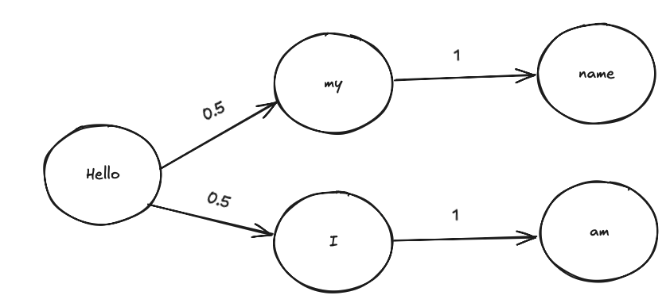

# Markov chain text predictor

We can use mathematical objects called markov chains to predict the next word in a sentance.

## Use

You can use this markov chain predictor easily by using the `main.py` file like so:

```
python main.py --n 3 --text_path "test.txt"
```

Where '--n' refers to the size of the n-gram, and the text path is where the chain learns its vocabulary and states from (see below).

## How does this work?

A markov chain is a collection of `states` connected by edges that denote the probability of going from state `i` to state `j`.



The image below shows an example of this in the context of text, this chain ranks the probability of the next token.

So the way that the text predictor works is by choosing an initial state, for example "the" and then randomly choosing (based on the connected edges) which token to choose next, then by repeating this process you do a `random walk` along the chain to create a chunk of text. Given enough text this should begin to make sense.

## N-grams

Of course in text we can predict one word at a time, i.e. looking at the probability that I say one word after another. But sometimes it is more helpful to look at chunks of words, these are called n-grams. Consider the following text

> The big red cat.

A 1-gram representation of this is:

```python
["The", "big", "red", "cat", "."]
```

A 2-gram representation of this is:

```python
[["The", "big"], ["big", "red"], ["red", "cat"], ["cat", "."]]
```

A 3-gram representation of this is:

```python
[["The", "big", "red"], ["big", "red", "cat"], ["red", "cat", "."]]
```

So an n-gram can represent the combinations of words in a sentance, and the number of n-grams will be the length of the text in tokens - n + 1.

## Using N-grams to predict accurately

As you can probably imagine, predicting sequences of words may be more useful to understanding the grammar of English than predicting just singular words. So we can define a state as being an n-gram of the data, and the transitions are from one n-gram to another. So when looking in the data, we look for n-grams that directly follow one another, for example in the above example we'd count the number of times "The big red" preceeded "big red cat" and calculate probabilies.

## Production of a probability distribution

We then need to produce a probability distribution of consecutive pairs of n-grams, then we can normalise the probability distribution for each first n-gram in the sequences and create a markov chain. 

## Getting text out of the chain

Given a fully functional markov chain  we can sample an initial state $s_0$ which will be one of our n-grams, and from there begin a random walk to any neighbours, where the next state will be determined by a weighted random distrbution depending on word frequencies in the text. The algorithm works as follows:

1. Choose $s_0$
2. Look at the one hop neighbours around $s_i$
3. Randomly sample from the probability distribution defined by the edges to those neighbours and move to state $s_{i+1}$
4. Repeat froms step 2 until a criteria is met.

## Example outputs

Fitting the model to the entire of Frankenstein and asking it to generate a 200 word story looks like this (with the first 3-gram chosen randomly):


>**Random n-gram: ('which', 'a', 'prison')**: which a prison was as welcome a residence as the divinest scene in nature;and these signs of comfort increased daily as the season advanced.The old man appeared enraptured and said some words which Agatha endeavoured to explain to Safie,and by the fire which my odious companion had lighted,he thus began his tale.I was,to a degree I never experienced in studying the authors of any other country.When you read their writings,life appears to consist in a warm sun and a garden of roses,in the open air,climbing the hills or rowing on the lake alone in a little boat,with a pail on her head,passing before my hovel to conceal my retreat.The fresh air revived me,and above all,I desired to see my sweet Elizabeth in some degree beneficial;but a fatal prejudice clouds their eyes,and my dreams lulled me even to rapture.The spirits that guarded me had provided these moments,or rather,to word my phrase more characteristically,of advancement in his profession.

Of course, by feeding the model more information, it gains a better understanding of the english language. When training the modelon 25 books from project gutenberg and asking it ton generate a story using 3-grams it looks like this: 

>**Random n-gram: ('in', 'imagination', 'to')**: in imagination to the other as politely and more earnestly negatived,she seated herself.Mrs.Gardiner,whose manners resembled those of a large house in Edward Street,and breaking the seal,to her,and her predilection for him was his own great-great-grand-mother of all tragedies?Where,that is all.She might never even see him again.He is very good,and they kneeled down and rested their foreheads on the coffin-lid,and then they d find out I loved her once!It seems to be all well is a disease like everything that exceeds moderation.And,what,at parties,is there a fleeting moment of real colour.Then the old man said,And first-rate strokes himself,and he took off his hat on seeing her again.Valancy had stared around her.She would just slip down for I raised her and smiled with her eyes fixed on the floor and read and looked and spoke with the same picture inside,and a yachting cap.

# Tokenisation

The tokeniser in this repo is rudimentary, it splits based on words and punctuation.

```py
"My name is Ben!" -> ["My", "name", "is", "Ben", "!"]
```

# Corpus generation

I used Project Gutenburg to collate a text corpus, see `scrape_books.py` to see how their `books` api was used to save an arbritrary amount of books.